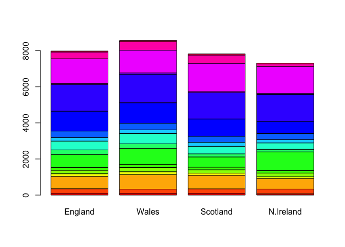
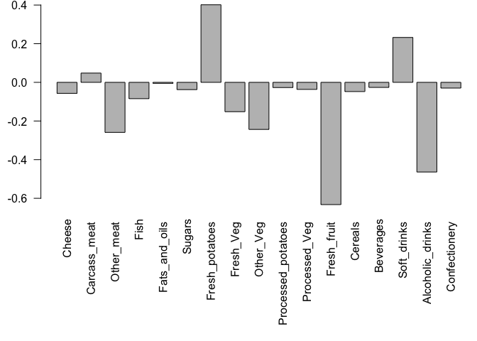

class08
================
tiantaima
10/25/2019

## k means example

``` r
 # Generate some example data for clustering
tmp <- c(rnorm(30,-3), rnorm(30,3)) 
x <- cbind(x=tmp, y=rev(tmp))
plot(x)
```

<!-- -->

\#\#Use the kmeans() function setting k to 2 and nstart=20 Inspect/print
the results Q. How many points are in each cluster? Q. What ‘component’
of your result object details - cluster size? - cluster
assignment/membership? - cluster center? Plot x colored by the kmeans
cluster assignment and add cluster centers as blue points

``` r
k <- kmeans(x,centers = 2, nstart = 20)
k
```

    ## K-means clustering with 2 clusters of sizes 30, 30
    ## 
    ## Cluster means:
    ##           x         y
    ## 1 -2.978918  3.087560
    ## 2  3.087560 -2.978918
    ## 
    ## Clustering vector:
    ##  [1] 1 1 1 1 1 1 1 1 1 1 1 1 1 1 1 1 1 1 1 1 1 1 1 1 1 1 1 1 1 1 2 2 2 2 2
    ## [36] 2 2 2 2 2 2 2 2 2 2 2 2 2 2 2 2 2 2 2 2 2 2 2 2 2
    ## 
    ## Within cluster sum of squares by cluster:
    ## [1] 37.27647 37.27647
    ##  (between_SS / total_SS =  93.7 %)
    ## 
    ## Available components:
    ## 
    ## [1] "cluster"      "centers"      "totss"        "withinss"    
    ## [5] "tot.withinss" "betweenss"    "size"         "iter"        
    ## [9] "ifault"

``` r
table(k$cluster)
```

    ## 
    ##  1  2 
    ## 30 30

``` r
plot(x, col=k$cluster)
points(k$centers, col="blue", pch=15)
```

<!-- -->

## Hierarchical clustering in R

``` r
hc <- hclust(dist(x))
```

## plot my result

``` r
plot(hc)

abline(h=4, col="blue")
```

<!-- -->

``` r
cutree(hc, h=4)
```

    ##  [1] 1 1 1 1 1 1 1 1 1 1 1 1 1 1 1 1 1 1 1 1 1 1 1 1 1 1 1 1 1 1 2 2 2 2 2
    ## [36] 2 2 2 2 2 2 2 2 2 2 2 2 2 2 2 2 2 2 2 2 2 2 2 2 2

``` r
greps <- cutree (hc, h=4)
table(greps)
```

    ## greps
    ##  1  2 
    ## 30 30

``` r
greps <- cutree(hc,k=2)
greps
```

    ##  [1] 1 1 1 1 1 1 1 1 1 1 1 1 1 1 1 1 1 1 1 1 1 1 1 1 1 1 1 1 1 1 2 2 2 2 2
    ## [36] 2 2 2 2 2 2 2 2 2 2 2 2 2 2 2 2 2 2 2 2 2 2 2 2 2

``` r
plot(x, col = greps)
```

<!-- -->

``` r
 #Step 1. Generate some example data for clustering
x <- rbind(
matrix(rnorm(100, mean=0, sd = 0.3), ncol = 2), # c1
matrix(rnorm(100, mean = 1, sd = 0.3), ncol = 2), # c2
matrix(c(rnorm(50, mean = 1, sd = 0.3), # c3
rnorm(50, mean = 0, sd = 0.3)), ncol = 2))
colnames(x) <- c("x", "y")

# Step 2. Plot the data without clustering
plot(x)
```

<!-- -->

``` r
# Step 3. Generate colors for known clusters
# (just so we can compare to hclust results) 
col <- as.factor( rep(c("c1","c2","c3"), each=50) )
plot(x, col=col)
```

<!-- -->

``` r
# cluster 
hc <- hclust(dist(x))
plot(hc)
abline(h=2.9, col="blue")
```

<!-- -->

``` r
greps <- cutree(hc, k=3)
plot(x, col=greps)
```

<!-- -->

``` r
table(col,greps)
```

    ##     greps
    ## col   1  2  3
    ##   c1 49  1  0
    ##   c2  1 21 28
    ##   c3  2 48  0

``` r
mydata <- read.csv("https://tinyurl.com/expression-CSV", row.names=1)
mydata
```

    ##          wt1 wt2  wt3  wt4  wt5 ko1  ko2  ko3  ko4  ko5
    ## gene1    439 458  408  429  420  90   88   86   90   93
    ## gene2    219 200  204  210  187 427  423  434  433  426
    ## gene3   1006 989 1030 1017  973 252  237  238  226  210
    ## gene4    783 792  829  856  760 849  856  835  885  894
    ## gene5    181 249  204  244  225 277  305  272  270  279
    ## gene6    460 502  491  491  493 612  594  577  618  638
    ## gene7     27  30   37   29   34 304  304  285  311  285
    ## gene8    175 182  184  166  180 255  291  305  271  269
    ## gene9    658 669  653  633  657 628  627  603  635  620
    ## gene10   121 116  134  117  133 931  941  990  982  934
    ## gene11   337 337  330  322  313 100   95   94  101   79
    ## gene12   214 194  213  192  207  97   91   89  124   97
    ## gene13   789 738  807  768  820 293  308  312  303  325
    ## gene14   458 490  493  446  496 694  682  679  702  719
    ## gene15   551 555  527  552  503 712  742  718  808  739
    ## gene16   390 400  403  402  401 755  765  730  713  740
    ## gene17   900 970  905  850  834 353  380  380  385  386
    ## gene18   951 991  991  983  984 217  195  195  196  197
    ## gene19   436 414  388  418  410 162  169  143  151  130
    ## gene20   244 266  228  223  240 540  536  577  538  513
    ## gene21   119  87   87   88   93 914  906  914  913  921
    ## gene22   156 170  150  167  155 346  372  393  416  384
    ## gene23    89  97   96   97   82 788  786  750  822  785
    ## gene24   570 567  563  587  563 424  481  489  456  465
    ## gene25   788 796  766  778  825 456  403  446  447  442
    ## gene26  1007 972  977 1003 1027 945  859  933  844  925
    ## gene27   937 876  901  958  957 414  405  383  437  394
    ## gene28   224 232  231  238  226 850  902  907  842  817
    ## gene29   809 869  815  788  781 482  484  518  498  491
    ## gene30   624 598  587  552  592 956  985  940  963  982
    ## gene31   218 259  213  204  213  69   86   59   65   46
    ## gene32   906 798  828  874  890 541  626  576  607  586
    ## gene33   262 291  258  271  279 534  566  570  565  563
    ## gene34   155 172  173  173  192 643  639  713  706  676
    ## gene35   100 104   94  114   90 212  228  233  229  258
    ## gene36   117 147  120  147  145 353  347  371  335  357
    ## gene37   286 262  260  270  293 360  375  361  348  374
    ## gene38   321 353  334  340  316 642  575  588  595  665
    ## gene39   388 372  345  373  359  50   45   39   44   35
    ## gene40   606 576  558  581  574 415  406  423  455  412
    ## gene41   379 377  362  346  354 991 1010 1020  976 1036
    ## gene42   471 492  473  470  471 401  401  426  425  418
    ## gene43   592 615  602  602  655 514  554  501  511  553
    ## gene44   755 733  775  687  776 255  245  251  249  252
    ## gene45    35  40   28   25   32 947  988  994  989  971
    ## gene46   758 734  704  761  672 567  575  596  607  611
    ## gene47    24  25   12   13   22 324  293  292  303  295
    ## gene48   100 113  136  117  103 912  940  901  950  868
    ## gene49   809 825  833  800  776 538  524  487  527  507
    ## gene50   955 994  994  975  973 175  158  191  218  183
    ## gene51   453 419  443  459  469 174  134  166  148  154
    ## gene52   327 320  324  321  318 489  470  495  451  457
    ## gene53   657 669  631  701  647 246  276  255  266  287
    ## gene54   678 638  676  683  671 259  247  238  214  235
    ## gene55   304 325  312  327  320 819  802  773  790  820
    ## gene56   659 687  659  667  639 109  102  105  119   96
    ## gene57   673 668  694  699  726  18   14   19   18   14
    ## gene58   785 772  817  766  784 467  474  460  461  481
    ## gene59   501 513  462  484  504  37   64   71   58   50
    ## gene60   232 228  193  247  231 997  983  997  990 1011
    ## gene61   928 936 1015  971  964 428  457  447  434  431
    ## gene62   159 169  163  151  166 869  975  955  929  948
    ## gene63   336 344  372  389  357 664  575  577  625  630
    ## gene64   968 888  907  914  883 886  855  844  848  862
    ## gene65   339 335  373  338  328 275  290  270  303  280
    ## gene66    35  32   45   37   38 765  746  756  758  761
    ## gene67    27  28   25   35   27 200  194  189  181  173
    ## gene68    80  69   87   87   81 693  693  677  683  688
    ## gene69   744 685  733  693  746 745  680  780  791  792
    ## gene70   766 739  751  720  738 645  603  610  598  612
    ## gene71   672 736  672  715  693 839  872  909  811  803
    ## gene72   526 553  534  511  529 922  819  878  832  853
    ## gene73   627 650  664  622  606 805  836  836  828  800
    ## gene74   468 466  477  469  494 703  661  669  632  640
    ## gene75   986 945 1006 1020 1024 359  358  346  356  345
    ## gene76   348 333  344  321  296 770  773  750  769  774
    ## gene77   719 714  734  693  682 620  567  582  614  546
    ## gene78   883 899  868  873  882 803  765  767  783  749
    ## gene79   837 883  864  807  854 210  239  234  258  220
    ## gene80   666 657  719  656  638 549  588  586  571  583
    ## gene81   804 735  771  763  813 613  587  591  563  613
    ## gene82   476 494  521  494  482 183  184  156  173  161
    ## gene83   438 430  477  457  481 466  525  518  474  478
    ## gene84   938 934  976  965  960 904 1011  949  947  934
    ## gene85    29  29   30   19   21 618  589  618  563  574
    ## gene86   810 830  760  796  807 486  542  507  471  543
    ## gene87   575 579  567  565  576 352  321  296  332  311
    ## gene88   451 471  494  447  470 540  583  572  551  591
    ## gene89   174 170  205  175  179 298  290  319  313  264
    ## gene90   158 122  138  159  128 863  896  869  841  873
    ## gene91   371 367  369  339  360 103   85   83   94   70
    ## gene92   853 798  866  843  823 934 1007  936  918 1005
    ## gene93   208 214  200  196  206 409  408  403  368  380
    ## gene94   555 584  574  599  581 292  341  335  324  299
    ## gene95   527 573  548  548  552 686  718  705  704  677
    ## gene96   589 607  579  536  583 497  479  479  467  504
    ## gene97   396 384  382  399  401 460  442  466  452  457
    ## gene98    33  27   39   42   33 977 1031 1033 1003  974
    ## gene99   321 343  349  367  343 949  947  982 1021 1010
    ## gene100   25  34   34   36   32 661  685  678  655  693

``` r
pca <- prcomp(t(mydata), scale=TRUE)
attributes(pca)
```

    ## $names
    ## [1] "sdev"     "rotation" "center"   "scale"    "x"       
    ## 
    ## $class
    ## [1] "prcomp"

``` r
pca$x[,1]
```

    ##       wt1       wt2       wt3       wt4       wt5       ko1       ko2 
    ## -9.697374 -9.138950 -9.054263 -8.731483 -9.006312  8.846999  9.213885 
    ##       ko3       ko4       ko5 
    ##  9.458412  8.883412  9.225673

``` r
plot(pca$x[,1],pca$x[,2])
```

<!-- -->

``` r
summary(pca)
```

    ## Importance of components:
    ##                           PC1    PC2     PC3     PC4     PC5     PC6
    ## Standard deviation     9.6237 1.5198 1.05787 1.05203 0.88062 0.82545
    ## Proportion of Variance 0.9262 0.0231 0.01119 0.01107 0.00775 0.00681
    ## Cumulative Proportion  0.9262 0.9493 0.96045 0.97152 0.97928 0.98609
    ##                            PC7     PC8     PC9      PC10
    ## Standard deviation     0.80111 0.62065 0.60342 3.348e-15
    ## Proportion of Variance 0.00642 0.00385 0.00364 0.000e+00
    ## Cumulative Proportion  0.99251 0.99636 1.00000 1.000e+00

``` r
## Precent variance is often more informative to look at
pca.var <- pca$sdev^2
pca.var.per <- round(pca.var/sum(pca.var)*100, 1)
pca.var.per
```

    ##  [1] 92.6  2.3  1.1  1.1  0.8  0.7  0.6  0.4  0.4  0.0

``` r
pca.var <- pca$sdev^2
pca.var.per <- round(pca.var/sum(pca.var)*100, 1)
barplot(pca.var.per, main="Scree Plot",
xlab="Principal Component", ylab="Percent Variation")
```

<!-- -->

``` r
# Alternatively 
plot(pca)
```

<!-- -->

``` r
plot(pca$x[,1:2], col=c("red","red","red","red","red","blue","blue","blue","blue","blue"))
```

<!-- -->

``` r
rep("red",5)
```

    ## [1] "red" "red" "red" "red" "red"

``` r
x <- read.csv("UK_foods.csv")
x
```

    ##                      X England Wales Scotland N.Ireland
    ## 1               Cheese     105   103      103        66
    ## 2        Carcass_meat      245   227      242       267
    ## 3          Other_meat      685   803      750       586
    ## 4                 Fish     147   160      122        93
    ## 5       Fats_and_oils      193   235      184       209
    ## 6               Sugars     156   175      147       139
    ## 7      Fresh_potatoes      720   874      566      1033
    ## 8           Fresh_Veg      253   265      171       143
    ## 9           Other_Veg      488   570      418       355
    ## 10 Processed_potatoes      198   203      220       187
    ## 11      Processed_Veg      360   365      337       334
    ## 12        Fresh_fruit     1102  1137      957       674
    ## 13            Cereals     1472  1582     1462      1494
    ## 14           Beverages      57    73       53        47
    ## 15        Soft_drinks     1374  1256     1572      1506
    ## 16   Alcoholic_drinks      375   475      458       135
    ## 17      Confectionery       54    64       62        41

``` r
nrow(x)
```

    ## [1] 17

``` r
ncol
```

    ## function (x) 
    ## dim(x)[2L]
    ## <bytecode: 0x7fbb7c5a0e28>
    ## <environment: namespace:base>

``` r
head(x)
```

    ##                X England Wales Scotland N.Ireland
    ## 1         Cheese     105   103      103        66
    ## 2  Carcass_meat      245   227      242       267
    ## 3    Other_meat      685   803      750       586
    ## 4           Fish     147   160      122        93
    ## 5 Fats_and_oils      193   235      184       209
    ## 6         Sugars     156   175      147       139

``` r
tail(x)
```

    ##                    X England Wales Scotland N.Ireland
    ## 12      Fresh_fruit     1102  1137      957       674
    ## 13          Cereals     1472  1582     1462      1494
    ## 14         Beverages      57    73       53        47
    ## 15      Soft_drinks     1374  1256     1572      1506
    ## 16 Alcoholic_drinks      375   475      458       135
    ## 17    Confectionery       54    64       62        41

``` r
rownames(x) <- x[,1]
x <- x[,-1]
head(x)
```

    ##                England Wales Scotland N.Ireland
    ## Cheese             105   103      103        66
    ## Carcass_meat       245   227      242       267
    ## Other_meat         685   803      750       586
    ## Fish               147   160      122        93
    ## Fats_and_oils      193   235      184       209
    ## Sugars             156   175      147       139

``` r
dim(x)
```

    ## [1] 17  4

``` r
barplot(as.matrix(x), beside=T, col=rainbow(nrow(x)))
```

<!-- -->

``` r
barplot(as.matrix(x), beside=F, col=rainbow(nrow(x)))
```

<!-- -->

``` r
pairs(x, col=rainbow(10), pch=16)
```

<!-- -->

``` r
pca <- prcomp( t(x) )
summary(pca)
```

    ## Importance of components:
    ##                             PC1      PC2      PC3       PC4
    ## Standard deviation     324.1502 212.7478 73.87622 4.189e-14
    ## Proportion of Variance   0.6744   0.2905  0.03503 0.000e+00
    ## Cumulative Proportion    0.6744   0.9650  1.00000 1.000e+00

``` r
pca
```

    ## Standard deviations (1, .., p=4):
    ## [1] 3.241502e+02 2.127478e+02 7.387622e+01 4.188568e-14
    ## 
    ## Rotation (n x k) = (17 x 4):
    ##                              PC1          PC2         PC3          PC4
    ## Cheese              -0.056955380 -0.016012850 -0.02394295 -0.691718038
    ## Carcass_meat         0.047927628 -0.013915823 -0.06367111  0.635384915
    ## Other_meat          -0.258916658  0.015331138  0.55384854  0.198175921
    ## Fish                -0.084414983  0.050754947 -0.03906481 -0.015824630
    ## Fats_and_oils       -0.005193623  0.095388656  0.12522257  0.052347444
    ## Sugars              -0.037620983  0.043021699  0.03605745  0.014481347
    ## Fresh_potatoes       0.401402060  0.715017078  0.20668248 -0.151706089
    ## Fresh_Veg           -0.151849942  0.144900268 -0.21382237  0.056182433
    ## Other_Veg           -0.243593729  0.225450923  0.05332841 -0.080722623
    ## Processed_potatoes  -0.026886233 -0.042850761  0.07364902 -0.022618707
    ## Processed_Veg       -0.036488269  0.045451802 -0.05289191  0.009235001
    ## Fresh_fruit         -0.632640898  0.177740743 -0.40012865 -0.021899087
    ## Cereals             -0.047702858  0.212599678  0.35884921  0.084667257
    ## Beverages           -0.026187756  0.030560542  0.04135860 -0.011880823
    ## Soft_drinks          0.232244140 -0.555124311  0.16942648 -0.144367046
    ## Alcoholic_drinks    -0.463968168 -0.113536523  0.49858320 -0.115797605
    ## Confectionery       -0.029650201 -0.005949921  0.05232164 -0.003695024

``` r
# Plot PC1 vs PC2
plot(pca$x[,1], pca$x[,2], xlab="PC1", ylab="PC2", xlim=c(-270,500),pch=1, cex=0.5)
text(pca$x[,1], pca$x[,2], colnames(x), col=c(1,2,3,4))
```

<!-- -->

``` r
v <- round( pca$sdev^2/sum(pca$sdev^2) * 100 )
v
```

    ## [1] 67 29  4  0

``` r
z <- summary(pca)
z$importance
```

    ##                              PC1       PC2      PC3          PC4
    ## Standard deviation     324.15019 212.74780 73.87622 4.188568e-14
    ## Proportion of Variance   0.67444   0.29052  0.03503 0.000000e+00
    ## Cumulative Proportion    0.67444   0.96497  1.00000 1.000000e+00

``` r
barplot(v, xlab="Principal Component", ylab="Percent Variation")
```

<!-- -->

``` r
## Lets focus on PC1 as it accounts for > 90% of variance 
par(mar=c(10, 3, 0.35, 0))
barplot( pca$rotation[,1], las=2 )
```

<!-- -->

``` r
## The inbuilt biplot() can be useful for small datasets 
biplot(pca)         
```

<!-- -->
