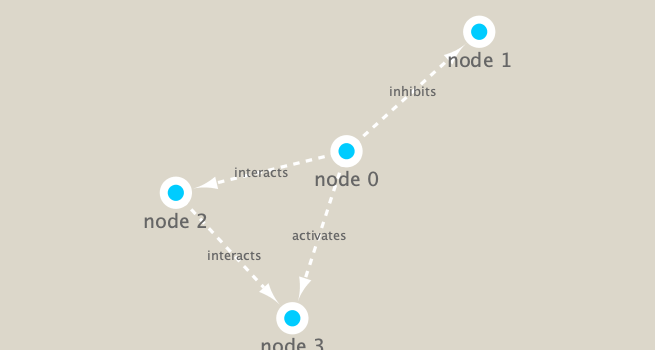

```{r setup, include=FALSE}
knitr::opts_chunk$set(echo = TRUE)
```

## Set up Cytoscape and R connection
```{r}
library(RCy3)
library(igraph)
library(RColorBrewer)
```

```{r}
# Test the connection to Cytoscape.
cytoscapePing()
```

```{r}
# Check the version
cytoscapeVersionInfo()
```

```{r}
g <- makeSimpleIgraph()
createNetworkFromIgraph(g,"myGraph")
```

```{r}
#we can include this Cytoscape rendered network image in our report with the following code:
fig <- exportImage(filename="demo", type="png", height=350)

```

## swithc styles

```{r}
setVisualStyle("Marquee")
```


```{r}
fig <- exportImage(filename="demo_marquee", type="png", height=350)

```


```{r}
styles <- getVisualStyleNames()
styles
#setVisualStyle(styles[13])
#setVisualStyle(styles[18])
```

```{r}
plot(g)
```


